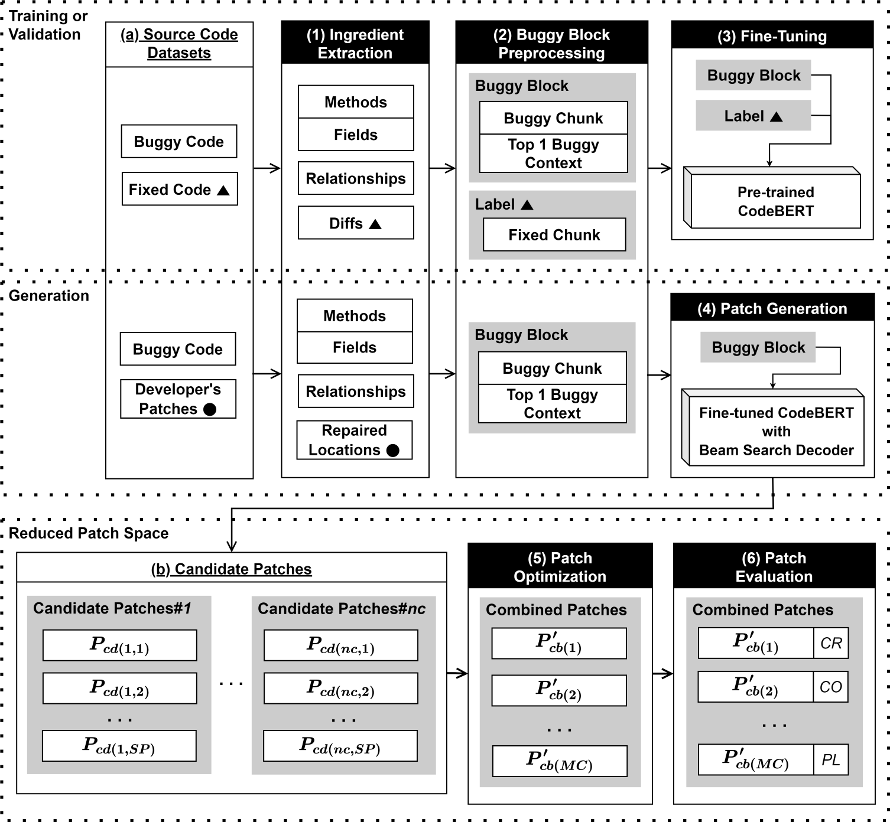

# MCRepair
* An Automated Program Repair (APR) technique that applied a buggy block, patch optimization, and CodeBERT to target complex multi-chunk bugs.
  * Buggy block: A novel method that binds buggy chunks into a multi-buggy chunk and preprocesses the chunk with its buggy contexts for patch space reduction and dependency problems.
  * Patch optimization: A novel strategy that effectively combines the generated candidate patches with patch space reduction.
  * CodeBERT: A BERT for source code datasets to address the lack of datasets and out-of-vocabulary problems. 
* Figures
  * [Figure 1:](./figures/Figure1.png) An overview of MCRepair. (▲: Only use for training or validation, ●: Only use for generation)
    
  * [Figure 2:](./figures/Figure2.png) The details of Ingredient Extraction and Buggy Block Preprocessing about an example of the source code datasets. (ST: Special Tokens, TR: Truncation)
  * [Figure 3:](./figures/Figure3.png) The details of Patch Optimization of the Candidate Patches. (DP: Duplicated, SE: Syntax Error, TC: Termination Code)
  * [Figure 4:](./figures/Figure4.png) RQ1. Venn Diagram for Table 2.
  * Figure 5: RQ2. Statistics per range on Defects4J with Perfect Fault Localization.
    * [Figure 5: (a) Chunk range](./figures/Figure5a.jpg)
    * [Figure 5: (b) Location range](./figures/Figure5b.jpg)
<br><br>

## 1. Location-level criterion
* We did not consider null, blank, and comment locations that were not related to “FAULT_OF_OMISSION.”
    - “FAULT_OF_OMISSION” is a buggy location related to insertions.
    - A null location is a location that only includes “;” or does nothing (e.g., “;” and “for (int i = 0; i < 10; i++);”).
    - A block’s end is not a null location because the block designates a flow range.
* We checked whether each location was correct.
* We distinguished divided and overlapped locations.
<br><br>

## 2. Bug types
The difficulties are in the order of Type 3, Type 2, and Type 1. If an APR technique has Type 1, Type 2, and Type 3 in a module, we resulted in Type 3 based on the difficulties.

* Type 1: A single-chunk bug that uses or fixes a location
    - T1B: A Type 1 bug that uses a location for fixing
    - T1F: A Type 1 bug that fixes a location
* Type 2: A single-chunk bug that uses or fixes locations
    - T2B: A Type 2 bug that use locations for fixing
    - T2F: A Type 2 bug that fixes locations
*  Type 3: A multi-chunk bug that uses or fixes chunks
    - T3B: A Type 3 bug that uses chunks for fixing
    - T3F: A Type 3 bug that fixes chunks
<br><br>

## 3. Statstics of bugs (66/75)
```powershell
  |--- Total (66/75)
  |------ Chart (5/6)
  |--------- Plausible (1) : [C_24]
  |--------- Correct (5)   : [C_1, 8, 9, 11, 20]
  |------ Closure (21/21)
  |--------- Correct(21)   : [CL_2, 7, 10, 11, 13, 19, 38, 40, 46, 57, 62, 70, 86, 92, 101, 102, 107, 109, 115, 122, 125]
  |------ Lang (9/10)
  |--------- Plausible (1) : [L_55]
  |--------- Correct (9)   : [L_6, 10, 29, 34, 43, 51, 57, 59, 64]
  |------ Math (24/30)
  |--------- Plausible (6) : [M_33, 62, 73, 84, 95, 96]
  |--------- Correct (24)  : [M_2, 5, 8, 18, 22, 27, 30, 32, 34, 41, 46, 57, 58, 63, 70, 72, 75, 77, 79, 80, 82, 85, 98, 104]
  |------ Mockito (4/4) 
  |--------- Correct (4)   : [MC_1, 5, 22, 29]
  |------ Time (3/4)
  |--------- Plausible (1) : [T_18]
  |--------- Correct (3)   : [T_4, 17, 19]
```
<br><br>

## 4. Details of correctly repaired bugs (66)
* Chart (5)
  * [C_1](./results/markdowns/Chart_1.md), [C_8](./results/markdowns/Chart_8.md), [C_9](./results/markdowns/Chart_9.md)
  * [C_11](./results/markdowns/Chart_11.md)
  * [C_20](./results/markdowns/Chart_20.md)
* Closure (21)
  * [CL_2](./results/markdowns/Closure_2.md), [CL_7](./results/markdowns/Closure_7.md)
  * [CL_10](./results/markdowns/Closure_10.md), [CL_11](./results/markdowns/Closure_11.md), [CL_13](./results/markdowns/Closure_13.md), [CL_19](./results/markdowns/Closure_19.md)
  * [CL_38](./results/markdowns/Closure_38.md)
  * [CL_40](./results/markdowns/Closure_40.md), [CL_46](./results/markdowns/Closure_46.md)
  * [CL_57](./results/markdowns/Closure_57.md)
  * [CL_62](./results/markdowns/Closure_62.md)
  * [CL_70](./results/markdowns/Closure_70.md)
  * [CL_86](./results/markdowns/Closure_86.md)
  * [CL_92](./results/markdowns/Closure_92.md)
  * [CL_101](./results/markdowns/Closure_101.md), [CL_102](./results/markdowns/Closure_102.md), [CL_107](./results/markdowns/Closure_107.md), [CL_109](./results/markdowns/Closure_109.md)
  * [CL_115](./results/markdowns/Closure_115.md)
  * [CL_122](./results/markdowns/Closure_122.md), [CL_125](./results/markdowns/Closure_125.md)
* Lang (9)
  * [L_6](./results/markdowns/Lang_6.md)
  * [L_10](./results/markdowns/Lang_10.md)
  * [L_29](./results/markdowns/Lang_29.md)
  * [L_34](./results/markdowns/Lang_34.md)
  * [L_43](./results/markdowns/Lang_43.md)
  * [L_51](./results/markdowns/Lang_51.md), [L_57](./results/markdowns/Lang_57.md), [L_59](./results/markdowns/Lang_59.md)
  * [L_64](./results/markdowns/Lang_64.md)
* Math (24)
  * [M_2](./results/markdowns/Math_2.md), [M_5](./results/markdowns/Math_5.md), [M_8](./results/markdowns/Math_8.md)
  * [M_18](./results/markdowns/Math_18.md)
  * [M_22](./results/markdowns/Math_22.md), [M_27](./results/markdowns/Math_27.md)
  * [M_30](./results/markdowns/Math_30.md), [M_32](./results/markdowns/Math_32.md), [M_34](./results/markdowns/Math_34.md)
  * [M_41](./results/markdowns/Math_41.md), [M_46](./results/markdowns/Math_46.md)
  * [M_57](./results/markdowns/Math_57.md), [M_58](./results/markdowns/Math_58.md)
  * [M_63](./results/markdowns/Math_63.md)
  * [M_70](./results/markdowns/Math_70.md), [M_72](./results/markdowns/Math_72.md), [M_75](./results/markdowns/Math_75.md), [M_77](./results/markdowns/Math_77.md), [M_79](./results/markdowns/Math_79.md)
  * [M_80](./results/markdowns/Math_80.md), [M_82](./results/markdowns/Math_82.md), [M_85](./results/markdowns/Math_85.md)
  * [M_98](./results/markdowns/Math_98.md)
  * [M_104](./results/markdowns/Math_104.md)
* Mockito (4)
  * [MC_1](./results/markdowns/Mockito_1.md), [MC_5](./results/markdowns/Mockito_5.md)
  * [MC_22](./results/markdowns/Mockito_22.md), [MC_29](./results/markdowns/Mockito_29.md)
* Time (3)
  * [T_4](./results/markdowns/Time_4.md)
  * [T_17](./results/markdowns/Time_17.md), [T_19](./results/markdowns/Time_19.md)
<br><br>

## 5. Statstics of correctly repaired bugs (66)
### 5.1. Statstics of correctly repaired bugs (66)
```powershell
  |--- Total (66)
  |------ Chart (5)    : [C_1, 8, 9, 11, 20]
  |------ Closure (21) : [CL_2, 7, 10, 11, 13, 19, 38, 40, 46, 57, 62, 70, 86, 92, 101, 102, 107, 109, 115, 122, 125]
  |------ Lang (9)     : [L_6, 10, 29, 34, 43, 51, 57, 59, 64]
  |------ Math (24)    : [M_2, 5, 8, 18, 22, 27, 30, 32, 34, 41, 46, 57, 58, 63, 70, 72, 75, 77, 79, 80, 82, 85, 98, 104]
  |------ Mockito (4)  : [MC_1, 5, 22, 29]
  |------ Time (3)     : [T_4, 17, 19]
```
<br>

### 5.2. Statstics of correctly repaired bugs per bug type (66)
```powershell
  |--- Total (66)
  |------ Chart (5)
  |--------- Type 1 (4)    : [C_8, 9, 11, 20]
  |--------- Type 3 (1)    : [C_1]
  |------ Closure (21)
  |--------- Type 1 (9)    : [CL_10, 38, 57, 62, 70, 92, 109, 122, 125]
  |--------- Type 2 (4)    : [CL_19, 86, 101, 107]
  |--------- Type 3 (8)    : [CL_2, 7, 11, 13, 40, 46, 102, 115]
  |------ Lang (9)
  |--------- Type 1 (5)    : [L_6, 29, 43, 57, 59]
  |--------- Type 2 (1)    : [L_51]
  |--------- Type 3 (3)    : [L_10, 34, 64]
  |------ Math (24)
  |--------- Type 1 (15)   : [M_2, 5, 27, 30, 32, 34, 41, 57, 58, 70, 75, 80, 82, 85, 104]
  |--------- Type 2 (1)    : [M_63]
  |--------- Type 3 (8)    : [M_8, 18, 22, 46, 72, 77, 79, 98]
  |------ Mockito (4)
  |--------- Type 1 (2)    : [MC_5, 29]
  |--------- Type 2 (1)    : [MC_1]
  |--------- Type 3 (1)    : [MC_22]
  |------ Time (3)
  |--------- Type 1 (2)    : [T_4, 19]
  |--------- Type 3 (1)    : [T_17]
```
<br>

### 5.3. Statstics of correctly repaired bugs per chunk (66)
```powershell
  |--- Total (66)
  |------ 1 chunk (44)
  |--------- Chart (4)     : [C_8, 9, 11, 20]
  |--------- Closure (13)  : [CL_10, 19, 38, 57, 62, 70, 86, 92, 101, 107, 109, 122, 125]
  |--------- Lang (6)      : [L_6, 29, 43, 51, 57, 59]
  |--------- Math (16)     : [M_2, 5, 27, 30, 32, 34, 41, 57, 58, 63, 70, 75, 80, 82, 85, 104]
  |--------- Mockito (3)   : [MC_1, 5, 29]
  |--------- Time (2)      : [T_7, 19]
  |------ 2 chunks (18)
  |--------- Chart (1)     : [C_1]
  |--------- Closure (5)   : [CL_2, 7, 11, 40, 115]
  |--------- Lang (3)      : [L_10, 34, 64]
  |--------- Math (7)      : [M_8, 22, 46, 72, 77, 79, 98]
  |--------- Time (1)      : [T_17]
  |--------- Mockito (1)   : [MC_22]
  |------ 3 chunks (3)
  |--------- Closure (3)   : [CL_13, 46, 102]
  |------ 4 chunks (1)
  |--------- Math (1)      : [M_18]
```
<br>

### 5.4. Statstics of correctly repaired bugs per location (66)
```powershell
  |--- Total (66)
  |------ 1 location (37)
  |--------- Chart (4)     : [C_8, 9, 11, 20]
  |--------- Closure (9)   : [CL_10, 38, 57, 62, 70, 92, 109, 122, 125]
  |--------- Lang (5)      : [L_6, 29, 43, 57, 59]
  |--------- Math (15)     : [M_2, 5, 27, 30, 32, 34, 41, 57, 58, 70, 75, 80, 82, 85, 104]
  |--------- Mockito (2)   : [MC_5, 29]
  |--------- Time (2)      : [T_7, 19]
  |------ 2 locations (12)
  |--------- Chart (1)     : [C_1]
  |--------- Closure (3)   : [CL_7, 19, 107]
  |--------- Lang (2)      : [L_34, 64]
  |--------- Math (6)      : [M_8, 22, 46, 72, 79, 98]
  |------ 3 locations (7)
  |--------- Closure (5)   : [CL_11, 13, 40, 86, 02]
  |--------- Lang (1)      : [L_51]
  |--------- Mockito (1)   : [MC_1]
  |------ 4 locations (3)
  |--------- Closure (2)   : [CL_2, 101]
  |--------- Math (1)      : [M_18]
  |------ 5 locations (3)
  |--------- Math (1)      : [M_63]
  |--------- Time (1)      : [T_17]
  |--------- Mockito (1)   : [MC_22]
  |------ 9 locations (1)
  |--------- Lang (1)      : [L_10]
  |------ 10 locations
  |--------- Math (1)      : [M_77]
  |------ 11 locations
  |--------- Closure (1)   : [CL_115]
  |------ 13 locations
  |--------- Closure (1)   : [CL_46]
```
<br><br>
